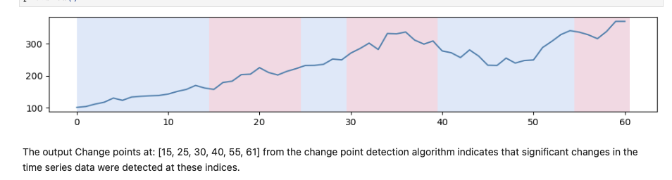
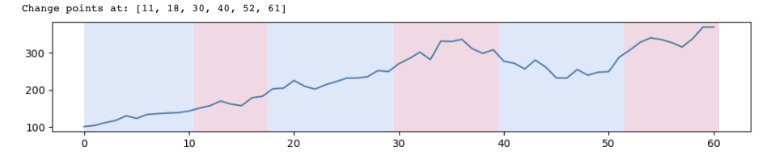
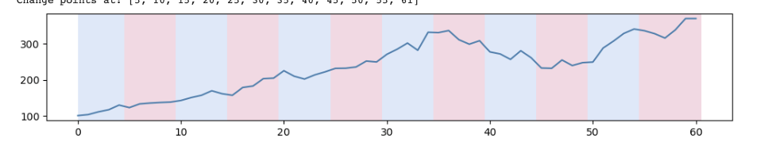
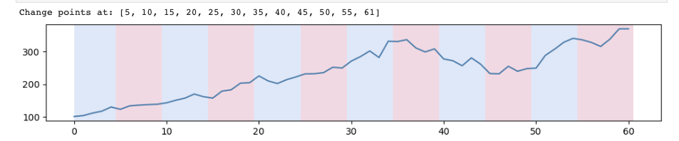

# Microsoft Change Point Detection

  <!-- Replace 'image_url' with the actual URL of your image -->
  

  
  
  
  
  
  

## Table of Contents
- [Why CPD - Change Point Detection](#why-cpd)
- [Data Source](#data-source)
- [Methods](#methods)
- [Tech Stack](#tech-stack)
- [Authors](#authors)
- [Project Documentation](#project-documentation)

## Why CPD?

Change Point Detection (CPD) in time series data is a critical technique used to identify points where the statistical properties of a dataset change significantly. This project focuses on detecting significant shifts in the closing prices of Microsoft Corporation (MSFT) stock. Such analysis is instrumental for investors and analysts in understanding critical shifts in stock behavior, informing investment strategies, and assessing market risks. For more information about this method, visit the following cite: https://en.wikipedia.org/wiki/Change_detection

## Data Source

The data for this project is sourced from historical stock market data of Microsoft Corporation, available on financial platforms like Yahoo Finance (Mothly filter 5 year lookback). This dataset includes:

- **Date**: The date for each data entry.
- **Open**: Opening stock price.
- **High**: Highest stock price during the day.
- **Low**: Lowest stock price during the day.
- **Close**: Closing stock price.
- **Adj Close**: Adjusted closing price accounting for dividends and stock splits.
- **Volume**: Number of shares traded.

The analysis is performed on monthly data, providing insights into the stock's performance over time.

## Methods

Several methods are employed for change point detection, each with its unique approach:

- **Binary Segmentation**: For quick and effective analysis of change points.
  

  <!-- Replace 'image_url' with the actual URL of your image -->
  

- **Kernel Change Method (RBF)**: To detect non-linear patterns and subtle shifts.

  <!-- Replace 'image_url' with the actual URL of your image -->
  

- **Bottom-Up Algorithm**: Ideal when the exact number of change points is unknown.

  <!-- Replace 'image_url' with the actual URL of your image -->
  

- **PELT Algorithm**: Efficient for large datasets,

  <!-- Replace 'image_url' with the actual URL of your image -->
  

