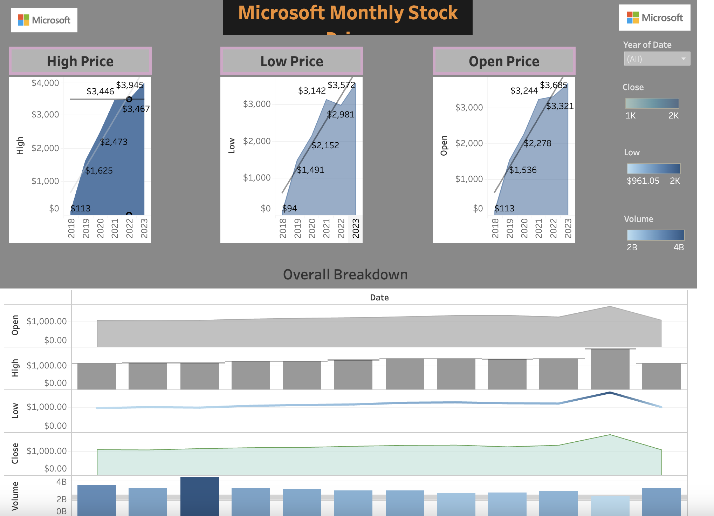

# Microsoft Change Point Detection

  <!-- Replace 'image_url' with the actual URL of your image -->
  

  
  
  
  
  
  
  

## Table of Contents
- [Introduction](#introduction)
- [Why CPD - Change Point Detection](#why-cpd)
- [Data Source](#data-source)
- [Methods](#methods)
- [Library](#Library-used)
- [Project Documentation](#project-documentation)

## Introduction
This project explores the realm of financial time series analysis, with a specific emphasis on detecting change points in the stock prices of Microsoft Corporation. The impetus for this investigation arises from the necessity to comprehend and forecast stock market trends, a fundamental aspect for informed investment decision-making.

## Why CPD?

Change Point Detection (CPD) is an essential method in time series analysis, used for pinpointing moments when a dataset undergoes significant statistical alterations. This project zeroes in on identifying notable changes in the closing prices of Microsoft Corporation (MSFT) stock. Such insights are invaluable for investors and market analysts, as they illuminate key shifts in stock performance. This knowledge aids in formulating investment strategies and in evaluating market risks. For a more comprehensive understanding of CPD, further information can be accessed at: https://en.wikipedia.org/wiki/Change_detection.

## Data Source

The dataset utilized in this project is derived from the historical stock market data of Microsoft Corporation. This data is publicly accessible on financial platforms such as Yahoo Finance, specifically using a 5-year lookback with a monthly filter. The dataset encompasses several key variables that are crucial for stock price analysis::

- **Date**: Indicates the specific date for each data point in the dataset.
- **Open**: The stock price at the opening of the trading day.
- **High**: The highest price that the stock reached during the trading day.
- **Low**: The lowest price of the stock on that day.
- **Close**: The stock price at the market close.
- **Adj Close**: The closing price after adjustments for any dividends or stock splits.
- **Volume**:  Represents the total number of shares of the stock that were traded during the day.

This comprehensive data set provides a foundation for analyzing trends, fluctuations, and potential change points in Microsoft Corporation’s stock prices over the specified period.

## Methods

Several methods are employed for change point detection, each with its unique approach:

- **Binary Segmentation**: For quick and effective analysis of change points.
  

  <!-- Replace 'image_url' with the actual URL of your image -->
  

- **Kernel Change Method (RBF)**: To detect non-linear patterns and subtle shifts.

  <!-- Replace 'image_url' with the actual URL of your image -->
  

- **Bottom-Up Algorithm**: Ideal when the exact number of change points is unknown.

  <!-- Replace 'image_url' with the actual URL of your image -->
  

- **PELT Algorithm**: Efficient for large datasets,

  <!-- Replace 'image_url' with the actual URL of your image -->
  

## Library-used
**Language and Libraries:**

- **Python:** Primary programming language for data analysis and algorithm implementation.
- **Ruptures:** A Python library specialized in change point detection in time series data. [Ruptures Documentation](https://centre-borelli.github.io/ruptures-docs/)
- **Pandas:** Used for data manipulation and analysis, particularly for handling the stock data. [Pandas Documentation](https://pandas.pydata.org/pandas-docs/stable/)
- **Matplotlib:** A plotting library for Python, utilized for visualizing the detected change points in the data. [Matplotlib Documentation](https://matplotlib.org/stable/contents.html)

**Algorithms Implemented:**

- **Binary Segmentation:** Efficient for large datasets, balancing accuracy and computational speed.
- **Kernel Change (RBF):** Captures non-linear relationships, ideal for complex data patterns.
- **Bottom Up:** Suitable for situations with uncertain number of change points, optimizes based on data characteristics.
- **PELT:** Optimal for large datasets, offering precision in change point detection.

## Project-documentation
**Key Findings:**

- Identified significant shifts in Microsoft Corporation's stock closing prices, crucial for financial analysis.
- Detected change points correlated with major market events, including earnings reports and macroeconomic changes.

**Analysis Insights:**

- Observed patterns such as trend shifts from bullish to bearish and vice versa.
- Identified periods of high and low volatility, providing insights into market dynamics.

**Impact:**

- The results contribute to a deeper understanding of stock market behavior, aiding in informed investment strategies.
- Enhanced risk assessment capabilities by pinpointing critical changes in the stock's performance.

**Visualizations:**

*Click on the image to see the interactive Tableau dashboard.*

- Change points were clearly illustrated using Matplotlib, offering an intuitive understanding of the data.
- Graphs depicted the relationship between stock price movements and detected change points.

### Conclusion

This project highlights the effectiveness of Python and the Ruptures library in analyzing time series data. The ability to detect and visualize change points in stock price data not only enriches financial analysis but also provides basic understanding. For code click -> [Here](https://github.com/dsrichard97/msft_CPD/blob/main/MSFT%20Change%20Point%20Detection.ipynb)

