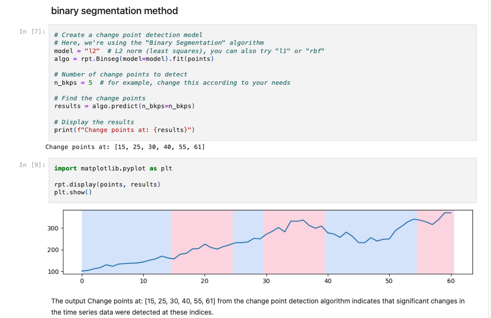
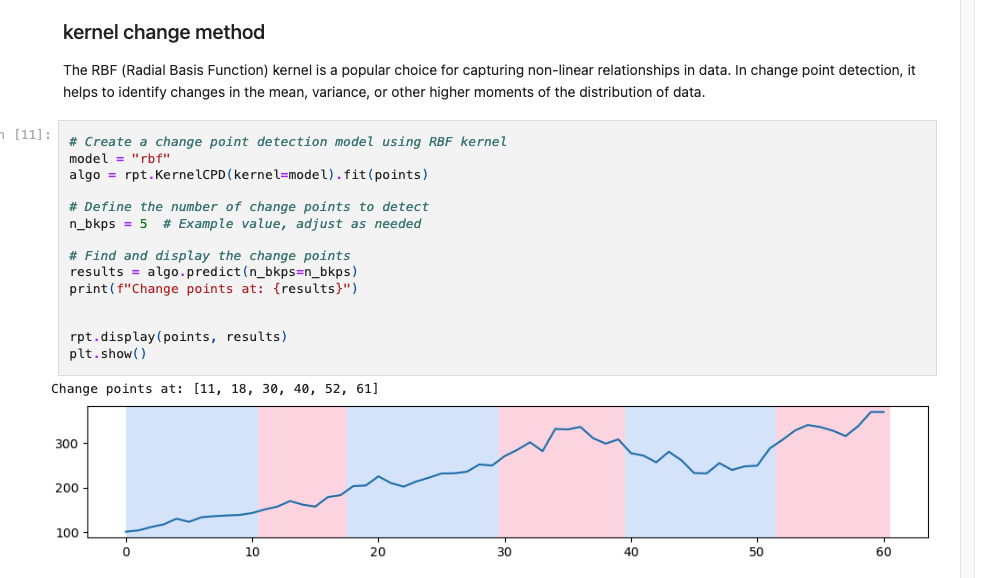
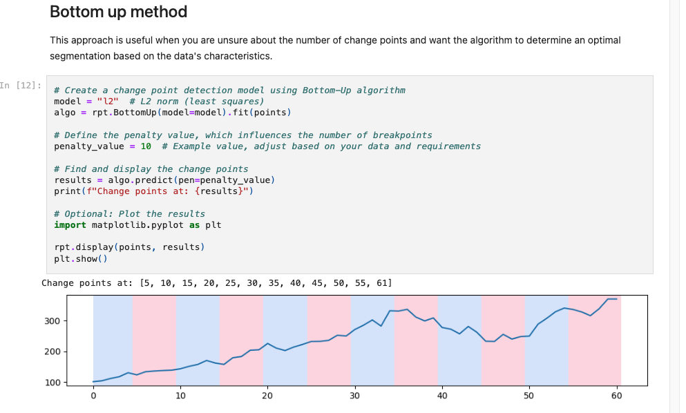
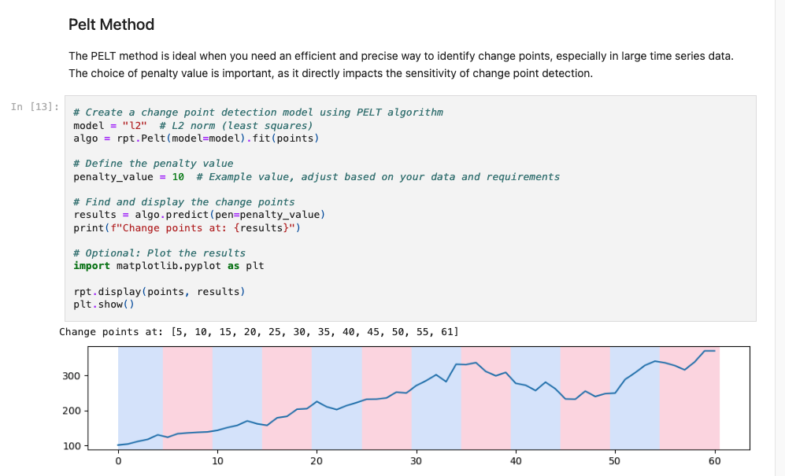
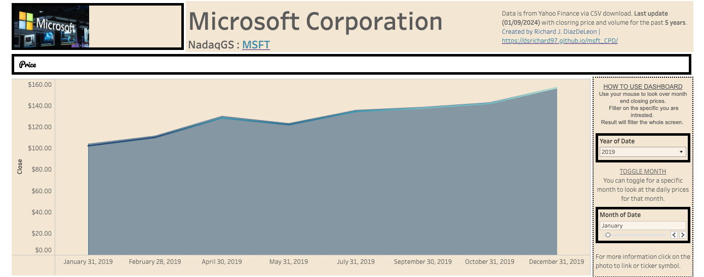

# Microsoft Change Point Detection

  <!-- Replace 'image_url' with the actual URL of your image -->
  

  
  
  
  
  
  
  

## Table of Contents
- [Introduction](#introduction)
- [Why CPD - Change Point Detection](#why-cpd)
- [Data Source](#data-source)
- [Methods](#methods)
- [Library](#Library-used)
- [Project Documentation](#project-documentation)

## Introduction
This project explores the realm of financial time series analysis, with a specific emphasis on detecting change points in the stock prices of Microsoft Corporation. The impetus for this investigation arises from the necessity to comprehend and forecast stock market trends, a fundamental aspect for informed investment decision-making.

## Why CPD?

Change Point Detection (CPD) is an essential method in time series analysis, used for pinpointing moments when a dataset undergoes significant statistical alterations. This project zeroes in on identifying notable changes in the closing prices of Microsoft Corporation (MSFT) stock. Such insights are invaluable for investors and market analysts, as they illuminate key shifts in stock performance. This knowledge aids in formulating investment strategies and in evaluating market risks. For a more comprehensive understanding of CPD, further information can be accessed at: https://en.wikipedia.org/wiki/Change_detection.

## Data Source

The dataset utilized in this project is derived from the historical stock market data of Microsoft Corporation. This data is publicly accessible on financial platforms such as Yahoo Finance, specifically using a 5-year lookback with a monthly filter. The dataset encompasses several key variables that are crucial for stock price analysis::

- **Date**: Indicates the specific date for each data point in the dataset.
- **Open**: The stock price at the opening of the trading day.
- **High**: The highest price that the stock reached during the trading day.
- **Low**: The lowest price of the stock on that day.
- **Close**: The stock price at the market close.
- **Adj Close**: The closing price after adjustments for any dividends or stock splits.
- **Volume**:  Represents the total number of shares of the stock that were traded during the day.

This comprehensive data set provides a foundation for analyzing trends, fluctuations, and potential change points in Microsoft Corporation’s stock prices over the specified period.

## Methods

Several methods are employed for change point detection, each with its unique approach:

- **Binary Segmentation**: Binary Segmentation is utilized as a method for identifying change points in time series data, such as stock prices. This technique is known for its speed and effectiveness in analyzing data for potential change points.
  
  

  <!-- Replace 'image_url' with the actual URL of your image -->
  

- **Kernel Change Method (RBF)**: The Kernel Change Method using the Radial Basis Function (RBF) is employed to identify change points in the stock price data. This method is particularly effective for detecting non-linear patterns and subtle shifts in time series data, which are common characteristics in financial markets. The RBF kernel is a powerful tool for this purpose due to its ability to capture complex, non-linear relationships within the data.

  <!-- Replace 'image_url' with the actual URL of your image -->
  

- **Bottom-Up Algorithm**: The Bottom-Up Algorithm is an effective approach used in this project, particularly suitable when the exact number of change points in a time series is unknown. This algorithm is widely recognized for its efficiency in analyzing sequences where change points are not predetermined or evident.
  

  <!-- Replace 'image_url' with the actual URL of your image -->
  

- **PELT Algorithm**: The Pruned Exact Linear Time (PELT) Algorithm is employed, particularly noted for its efficiency in handling large datasets. PELT is a state-of-the-art change point detection method that is well-suited for extensive time series data, such as stock market data.
  

  <!-- Replace 'image_url' with the actual URL of your image -->
  

## Library-used
**Language and Libraries:**

- **Python:** Primary programming language for data analysis and algorithm implementation.
- **Ruptures:** A Python library specialized in change point detection in time series data. [Ruptures Documentation](https://centre-borelli.github.io/ruptures-docs/)
- **Pandas:** Used for data manipulation and analysis, particularly for handling the stock data. [Pandas Documentation](https://pandas.pydata.org/pandas-docs/stable/)
- **Matplotlib:** A plotting library for Python, utilized for visualizing the detected change points in the data. [Matplotlib Documentation](https://matplotlib.org/stable/contents.html)

**Algorithms Implemented:**

- **Binary Segmentation:** Efficient for large datasets, balancing accuracy and computational speed.
- **Kernel Change (RBF):** Captures non-linear relationships, ideal for complex data patterns.
- **Bottom Up:** Suitable for situations with uncertain number of change points, optimizes based on data characteristics.
- **PELT:** Optimal for large datasets, offering precision in change point detection.

## Project-documentation
**Findings:**

- **Significant Shifts in Stock Prices:** The analysis successfully identified crucial shifts in the closing prices of Microsoft Corporation's stock. These shifts are fundamental to comprehensive financial analysis and investment decision-making.

- **Correlation with Market Events:** The detected change points exhibited a strong correlation with major market events. These include the release of earnings reports and shifts due to macroeconomic changes, highlighting the sensitivity of the stock to both internal corporate and external economic factors.

**Analysis Insights:**

- **Market Trends and Behavior:** The analysis revealed discernible patterns, such as transitions from bullish (upward) trends to bearish (downward) trends and vice versa. This reflects the dynamic nature of the stock market and the responsiveness of Microsoft's stock to varying conditions.

- **Volatility Insights:** Periods of high and low volatility were identified throughout the data, offering valuable insights into the stock’s market dynamics. Understanding these periods is key to grasping the stock's behavior under different market conditions.

**Impact of the Analysis:**

- **Enhanced Understanding of Market Behavior:** The results of this project contribute significantly to a deeper comprehension of stock market behavior, particularly in relation to Microsoft Corporation. This is vital for investors and analysts in formulating informed investment strategies.

- **Improved Risk Assessment:** By pinpointing critical changes in the stock's performance, the analysis enhances the ability to assess risks. Recognizing these change points aids in predicting potential market shifts and understanding the stock's reaction to various stimuli, thus facilitating more effective risk management.

Overall, this project has provided valuable insights into the behavior of Microsoft Corporation's stock, underscoring the importance of change point detection in financial analysis and its practical implications for investment and risk management strategies.**Next, is to change into an API that changes in real time the data.**

**Visualizations:**

*Click on the image to see the interactive Tableau dashboard.*

### Resources

-  [Tableau](https://public.tableau.com/views/MSFTTICKER5yrHorizon/Dashboard1?:language=en-US&:display_count=n&:origin=viz_share_link)
-  [Python Code](https://github.com/dsrichard97/msft_CPD/blob/main/MSFT%20Change%20Point%20Detection.ipynb)
-  [High Level Overview](https://github.com/dsrichard97/msft_CPD/blob/main/micro.png)
-  [PowerPoint](https://github.com/dsrichard97/msft_CPD/blob/main/msft.pdf)
-  [RAW DATA](https://github.com/dsrichard97/msft_CPD/blob/main/MSFT.csv)

